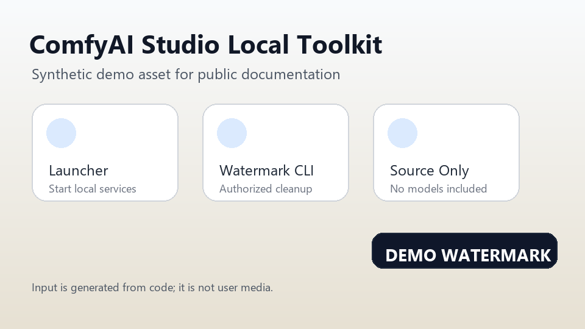
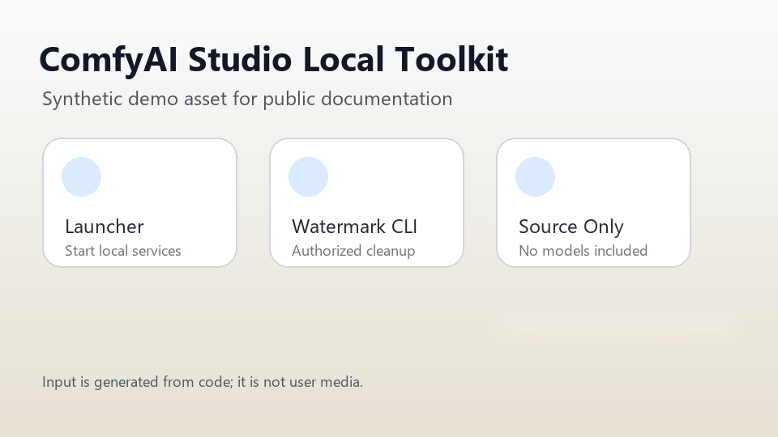

# 合成演示

本页展示本地图片清理工具的最小演示。演示图片由代码生成，只用于公开文档，
不是用户私有素材，也不包含真实照片、模型权重、生成输出目录或第三方素材。

## 输入



## 清理结果



## 复现命令

从仓库根目录执行：

```powershell
$python = "D:\conda_envs\comfyui\python.exe"
& $python -m watermark_tools.cli image `
  .\docs\assets\demo\synthetic-watermark-input.png `
  --box 610,382,304,58 `
  --output .\docs\assets\demo\synthetic-watermark-clean.png `
  --radius 5 `
  --dilate 8
```

## 说明

- `synthetic-watermark-input.png` 是用代码生成的合成图。
- `synthetic-watermark-clean.png` 是本地 `watermark_tools` 使用矩形区域清理后
  得到的结果。
- 该演示只用于验证文档和基础 CLI 流程，不代表所有真实水印场景都能达到相同
  效果。
- 处理真实媒体前，请确认你拥有素材或已获得明确授权，并阅读
  [负责使用说明](RESPONSIBLE_USE.md)。

